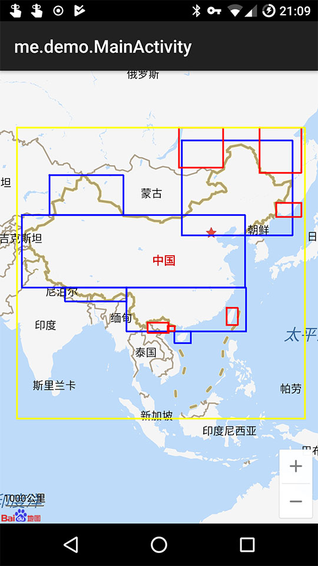

CoordTransform 坐标转换
---

[wandergis/coordtransform](https://github.com/wandergis/coordtransform)的Java版。
提供百度坐标（BD09）、国测局坐标（火星坐标，GCJ02）、和WGS84坐标系之间的转换的工具模块。  

**注意**：CoordinateTransformUtil的方法的输入输出参数都为`(lng, lat)`，和Android一般的`(lat, lng)`正好相反，使用时要注意一下。

## 国内外判断

黄色为原版的国内区域，蓝色和红色为修改后的国内区域

## 测试

- [CoordinateConverterTest.java](/src/test/java/me/demo/util/geo/test/CoordinateConverterTest.java)：将坐标转换后生成[Web版百度](http://lbsyun.baidu.com/index.php?title=uri/api/web)的Url，点开即可查看转换是否偏移

## 其他版本实现

- JavaScript版：[wandergis/coordtransform](https://github.com/wandergis/coordtransform)
- Python版：[wandergis/coordTransform_py](https://github.com/wandergis/coordTransform_py)
- Java版：[geosmart/coordtransform](https://github.com/geosmart/coordtransform)
- Dart/Flutter版：[ipcjs/coordtransform_dart](https://github.com/ipcjs/coordtransform_dart)

## 参考资料

- [Coordtransform 的使用文档](http://wandergis.com/coordtransform/)
